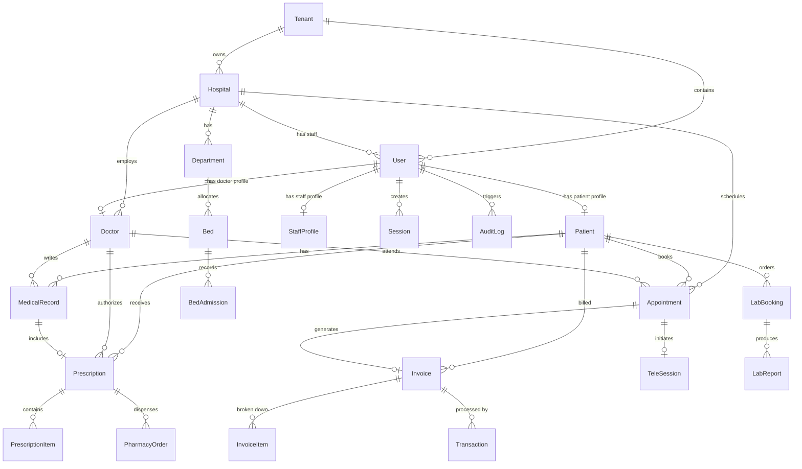

# APML Connect Pro - Database Design & Schema

This document details the database architecture, entity relationships, and production DDL for APML Connect Pro.

---

## 1. Entity-Relationship (ER) Diagram



---

## 2. PostgreSQL Schema (DDL)

```sql
-- Enums Setup
CREATE TYPE "Role" AS ENUM ('PATIENT', 'DOCTOR', 'NURSE', 'RECEPTIONIST', 'PHARMACIST', 'LAB_TECHNICIAN', 'HOSPITAL_ADMIN', 'SUPER_ADMIN');
CREATE TYPE "AppointmentStatus" AS ENUM ('SCHEDULED', 'COMPLETED', 'CANCELLED', 'NO_SHOW', 'IN_CONSULTATION');
CREATE TYPE "AppointmentType" AS ENUM ('IN_PERSON', 'VIDEO', 'VOICE');
CREATE TYPE "PaymentStatus" AS ENUM ('UNPAID', 'PAID', 'PARTIALLY_PAID', 'REFUNDED');
CREATE TYPE "BedStatus" AS ENUM ('AVAILABLE', 'OCCUPIED', 'MAINTENANCE');
CREATE TYPE "LabTestStatus" AS ENUM ('PENDING', 'SAMPLE_COLLECTED', 'COMPLETED', 'CANCELLED');

-- 1. Tenant Table (SaaS Isolation)
CREATE TABLE "Tenant" (
    "id" UUID PRIMARY KEY DEFAULT gen_random_uuid(),
    "name" VARCHAR(255) NOT NULL,
    "domain" VARCHAR(255) UNIQUE NOT NULL,
    "logoUrl" VARCHAR(512),
    "createdAt" TIMESTAMP WITH TIME ZONE DEFAULT CURRENT_TIMESTAMP NOT NULL,
    "updatedAt" TIMESTAMP WITH TIME ZONE DEFAULT CURRENT_TIMESTAMP NOT NULL
);

-- 2. Hospital Table
CREATE TABLE "Hospital" (
    "id" UUID PRIMARY KEY DEFAULT gen_random_uuid(),
    "tenantId" UUID NOT NULL REFERENCES "Tenant"("id") ON DELETE CASCADE,
    "name" VARCHAR(255) NOT NULL,
    "address" TEXT NOT NULL,
    "phone" VARCHAR(20) NOT NULL,
    "email" VARCHAR(255) NOT NULL
);

-- 3. User Table
CREATE TABLE "User" (
    "id" UUID PRIMARY KEY DEFAULT gen_random_uuid(),
    "tenantId" UUID NOT NULL REFERENCES "Tenant"("id") ON DELETE CASCADE,
    "email" VARCHAR(255) UNIQUE NOT NULL,
    "passwordHash" VARCHAR(255) NOT NULL,
    "role" "Role" NOT NULL,
    "firstName" VARCHAR(100) NOT NULL,
    "lastName" VARCHAR(100) NOT NULL,
    "phone" VARCHAR(20),
    "isEmailVerified" BOOLEAN DEFAULT FALSE NOT NULL,
    "isPhoneVerified" BOOLEAN DEFAULT FALSE NOT NULL,
    "twoFactorEnabled" BOOLEAN DEFAULT FALSE NOT NULL,
    "twoFactorSecret" VARCHAR(255),
    "createdAt" TIMESTAMP WITH TIME ZONE DEFAULT CURRENT_TIMESTAMP NOT NULL,
    "updatedAt" TIMESTAMP WITH TIME ZONE DEFAULT CURRENT_TIMESTAMP NOT NULL
);

-- 4. Session Table
CREATE TABLE "Session" (
    "id" UUID PRIMARY KEY DEFAULT gen_random_uuid(),
    "userId" UUID NOT NULL REFERENCES "User"("id") ON DELETE CASCADE,
    "token" VARCHAR(255) UNIQUE NOT NULL,
    "deviceDetails" TEXT,
    "ipAddress" VARCHAR(45),
    "expiresAt" TIMESTAMP WITH TIME ZONE NOT NULL,
    "createdAt" TIMESTAMP WITH TIME ZONE DEFAULT CURRENT_TIMESTAMP NOT NULL
);

-- 5. AuditLog Table (HIPAA Compliance log)
CREATE TABLE "AuditLog" (
    "id" UUID PRIMARY KEY DEFAULT gen_random_uuid(),
    "userId" UUID NOT NULL REFERENCES "User"("id") ON DELETE RESTRICT,
    "action" VARCHAR(100) NOT NULL,
    "resource" VARCHAR(100) NOT NULL,
    "resourceId" VARCHAR(100),
    "details" JSONB,
    "ipAddress" VARCHAR(45),
    "timestamp" TIMESTAMP WITH TIME ZONE DEFAULT CURRENT_TIMESTAMP NOT NULL
);

-- 6. Patient Table (Includes Encrypted Medical Identity)
CREATE TABLE "Patient" (
    "id" UUID PRIMARY KEY DEFAULT gen_random_uuid(),
    "userId" UUID UNIQUE NOT NULL REFERENCES "User"("id") ON DELETE CASCADE,
    "medicalRecordNumber" VARCHAR(50) UNIQUE NOT NULL,
    "dateOfBirth" DATE NOT NULL,
    "gender" VARCHAR(20) NOT NULL,
    "bloodGroup" VARCHAR(10),
    "address" TEXT,
    "emergencyContact" VARCHAR(100),
    "encryptedAadhaar" TEXT, -- AES-256 encrypted
    "medicalHistory" JSONB
);

-- 7. Doctor Table
CREATE TABLE "Doctor" (
    "id" UUID PRIMARY KEY DEFAULT gen_random_uuid(),
    "userId" UUID UNIQUE NOT NULL REFERENCES "User"("id") ON DELETE CASCADE,
    "hospitalId" UUID NOT NULL REFERENCES "Hospital"("id") ON DELETE RESTRICT,
    "specialization" VARCHAR(150) NOT NULL,
    "licenseNumber" VARCHAR(100) UNIQUE NOT NULL,
    "bio" TEXT,
    "consultationFee" NUMERIC(10, 2) NOT NULL,
    "videoFee" NUMERIC(10, 2) NOT NULL,
    "schedule" JSONB NOT NULL
);

-- 8. Department Table
CREATE TABLE "Department" (
    "id" UUID PRIMARY KEY DEFAULT gen_random_uuid(),
    "hospitalId" UUID NOT NULL REFERENCES "Hospital"("id") ON DELETE CASCADE,
    "name" VARCHAR(150) NOT NULL
);

-- 9. Bed Table (Hospital Resource Management)
CREATE TABLE "Bed" (
    "id" UUID PRIMARY KEY DEFAULT gen_random_uuid(),
    "hospitalId" UUID NOT NULL REFERENCES "Hospital"("id") ON DELETE CASCADE,
    "departmentId" UUID NOT NULL REFERENCES "Department"("id") ON DELETE CASCADE,
    "wardNumber" VARCHAR(50) NOT NULL,
    "bedNumber" VARCHAR(50) NOT NULL,
    "status" "BedStatus" DEFAULT 'AVAILABLE' NOT NULL
);

-- 10. Bed Admission Table
CREATE TABLE "BedAdmission" (
    "id" UUID PRIMARY KEY DEFAULT gen_random_uuid(),
    "bedId" UUID NOT NULL REFERENCES "Bed"("id") ON DELETE CASCADE,
    "patientId" UUID NOT NULL REFERENCES "Patient"("id") ON DELETE CASCADE,
    "admittedAt" TIMESTAMP WITH TIME ZONE DEFAULT CURRENT_TIMESTAMP NOT NULL,
    "dischargedAt" TIMESTAMP WITH TIME ZONE
);

-- 11. Appointment Table
CREATE TABLE "Appointment" (
    "id" UUID PRIMARY KEY DEFAULT gen_random_uuid(),
    "hospitalId" UUID NOT NULL REFERENCES "Hospital"("id") ON DELETE RESTRICT,
    "patientId" UUID NOT NULL REFERENCES "Patient"("id") ON DELETE CASCADE,
    "doctorId" UUID NOT NULL REFERENCES "Doctor"("id") ON DELETE RESTRICT,
    "date" TIMESTAMP WITH TIME ZONE NOT NULL,
    "status" "AppointmentStatus" DEFAULT 'SCHEDULED' NOT NULL,
    "type" "AppointmentType" DEFAULT 'IN_PERSON' NOT NULL,
    "reason" TEXT,
    "priority" VARCHAR(20) DEFAULT 'NORMAL' NOT NULL,
    "paymentStatus" "PaymentStatus" DEFAULT 'UNPAID' NOT NULL,
    "createdAt" TIMESTAMP WITH TIME ZONE DEFAULT CURRENT_TIMESTAMP NOT NULL,
    "updatedAt" TIMESTAMP WITH TIME ZONE DEFAULT CURRENT_TIMESTAMP NOT NULL
);

-- 12. TeleSession Table (WebRTC Metadata)
CREATE TABLE "TeleSession" (
    "id" UUID PRIMARY KEY DEFAULT gen_random_uuid(),
    "appointmentId" UUID UNIQUE NOT NULL REFERENCES "Appointment"("id") ON DELETE CASCADE,
    "channelName" VARCHAR(255) NOT NULL,
    "token" TEXT,
    "startedAt" TIMESTAMP WITH TIME ZONE,
    "endedAt" TIMESTAMP WITH TIME ZONE
);

-- 13. MedicalRecord Table (EHR/EMR Core)
CREATE TABLE "MedicalRecord" (
    "id" UUID PRIMARY KEY DEFAULT gen_random_uuid(),
    "patientId" UUID NOT NULL REFERENCES "Patient"("id") ON DELETE CASCADE,
    "doctorId" UUID NOT NULL REFERENCES "Doctor"("id") ON DELETE RESTRICT,
    "encounterDate" TIMESTAMP WITH TIME ZONE DEFAULT CURRENT_TIMESTAMP NOT NULL,
    "symptoms" TEXT NOT NULL,
    "diagnosis" TEXT NOT NULL,
    "icd10Codes" TEXT[] NOT NULL,
    "notes" TEXT,
    "aiSummary" TEXT,
    "voiceNoteUrl" VARCHAR(512),
    "createdAt" TIMESTAMP WITH TIME ZONE DEFAULT CURRENT_TIMESTAMP NOT NULL
);

-- 14. Prescription Table
CREATE TABLE "Prescription" (
    "id" UUID PRIMARY KEY DEFAULT gen_random_uuid(),
    "medicalRecordId" UUID UNIQUE NOT NULL REFERENCES "MedicalRecord"("id") ON DELETE CASCADE,
    "patientId" UUID NOT NULL REFERENCES "Patient"("id") ON DELETE CASCADE,
    "doctorId" UUID NOT NULL REFERENCES "Doctor"("id") ON DELETE RESTRICT,
    "digitalSignature" TEXT,
    "createdAt" TIMESTAMP WITH TIME ZONE DEFAULT CURRENT_TIMESTAMP NOT NULL
);

-- 15. PrescriptionItem Table
CREATE TABLE "PrescriptionItem" (
    "id" UUID PRIMARY KEY DEFAULT gen_random_uuid(),
    "prescriptionId" UUID NOT NULL REFERENCES "Prescription"("id") ON DELETE CASCADE,
    "medicineName" VARCHAR(255) NOT NULL,
    "dosage" VARCHAR(100) NOT NULL,
    "frequency" VARCHAR(100) NOT NULL,
    "duration" VARCHAR(100) NOT NULL,
    "instructions" TEXT
);

-- 16. Medicine Table (Inventory management)
CREATE TABLE "Medicine" (
    "id" UUID PRIMARY KEY DEFAULT gen_random_uuid(),
    "name" VARCHAR(255) UNIQUE NOT NULL,
    "genericName" VARCHAR(255) NOT NULL,
    "manufacturer" VARCHAR(255) NOT NULL,
    "stock" INT DEFAULT 0 NOT NULL,
    "price" NUMERIC(10, 2) NOT NULL,
    "category" VARCHAR(100) NOT NULL
);

-- 17. PharmacyOrder Table
CREATE TABLE "PharmacyOrder" (
    "id" UUID PRIMARY KEY DEFAULT gen_random_uuid(),
    "patientId" UUID NOT NULL REFERENCES "Patient"("id") ON DELETE CASCADE,
    "prescriptionId" UUID REFERENCES "Prescription"("id") ON DELETE SET NULL,
    "status" VARCHAR(50) NOT NULL,
    "totalAmount" NUMERIC(10, 2) NOT NULL,
    "paymentMethod" VARCHAR(50) NOT NULL,
    "trackingId" VARCHAR(100),
    "createdAt" TIMESTAMP WITH TIME ZONE DEFAULT CURRENT_TIMESTAMP NOT NULL
);

-- 18. LabBooking Table
CREATE TABLE "LabBooking" (
    "id" UUID PRIMARY KEY DEFAULT gen_random_uuid(),
    "patientId" UUID NOT NULL REFERENCES "Patient"("id") ON DELETE CASCADE,
    "testName" VARCHAR(255) NOT NULL,
    "status" "LabTestStatus" DEFAULT 'PENDING' NOT NULL,
    "bookingDate" DATE NOT NULL,
    "createdAt" TIMESTAMP WITH TIME ZONE DEFAULT CURRENT_TIMESTAMP NOT NULL
);

-- 19. LabReport Table
CREATE TABLE "LabReport" (
    "id" UUID PRIMARY KEY DEFAULT gen_random_uuid(),
    "bookingId" UUID NOT NULL REFERENCES "LabBooking"("id") ON DELETE CASCADE,
    "resultData" JSONB NOT NULL,
    "fileUrl" VARCHAR(512) NOT NULL,
    "uploadedAt" TIMESTAMP WITH TIME ZONE DEFAULT CURRENT_TIMESTAMP NOT NULL
);

-- 20. Invoice Table
CREATE TABLE "Invoice" (
    "id" UUID PRIMARY KEY DEFAULT gen_random_uuid(),
    "patientId" UUID NOT NULL REFERENCES "Patient"("id") ON DELETE CASCADE,
    "appointmentId" UUID UNIQUE REFERENCES "Appointment"("id") ON DELETE SET NULL,
    "amount" NUMERIC(10, 2) NOT NULL,
    "tax" NUMERIC(10, 2) NOT NULL,
    "discount" NUMERIC(10, 2) DEFAULT 0.00 NOT NULL,
    "total" NUMERIC(10, 2) NOT NULL,
    "status" "PaymentStatus" DEFAULT 'UNPAID' NOT NULL,
    "dueDate" DATE NOT NULL,
    "createdAt" TIMESTAMP WITH TIME ZONE DEFAULT CURRENT_TIMESTAMP NOT NULL
);

-- 21. InvoiceItem Table
CREATE TABLE "InvoiceItem" (
    "id" UUID PRIMARY KEY DEFAULT gen_random_uuid(),
    "invoiceId" UUID NOT NULL REFERENCES "Invoice"("id") ON DELETE CASCADE,
    "description" TEXT NOT NULL,
    "quantity" INT DEFAULT 1 NOT NULL,
    "unitPrice" NUMERIC(10, 2) NOT NULL,
    "amount" NUMERIC(10, 2) NOT NULL
);

-- 22. Transaction Table
CREATE TABLE "Transaction" (
    "id" UUID PRIMARY KEY DEFAULT gen_random_uuid(),
    "invoiceId" UUID NOT NULL REFERENCES "Invoice"("id") ON DELETE CASCADE,
    "amount" NUMERIC(10, 2) NOT NULL,
    "gateway" VARCHAR(50) NOT NULL,
    "referenceId" VARCHAR(255),
    "status" VARCHAR(50) NOT NULL,
    "createdAt" TIMESTAMP WITH TIME ZONE DEFAULT CURRENT_TIMESTAMP NOT NULL
);
```

---

## 3. Performance & Security Indexing Strategy

To keep search times sub-millisecond even with millions of records, the following composite indexes are implemented:

```sql
-- Quick tenant isolation filtering
CREATE INDEX idx_user_tenant ON "User"("tenantId");
CREATE INDEX idx_hospital_tenant ON "Hospital"("tenantId");

-- Optimize patient lookup by mobile or identity
CREATE INDEX idx_user_email_phone ON "User"("email", "phone");

-- Search appointments by date & hospital (Calendar/OPD views)
CREATE INDEX idx_appointment_hospital_date ON "Appointment"("hospitalId", "date");
CREATE INDEX idx_appointment_doctor_date ON "Appointment"("doctorId", "date");

-- Fast EMR lookup by patient
CREATE INDEX idx_medical_record_patient ON "MedicalRecord"("patientId");

-- Audit logging performance (Sorted descending for time-series access)
CREATE INDEX idx_audit_log_timestamp ON "AuditLog"("timestamp" DESC);
CREATE INDEX idx_audit_log_user ON "AuditLog"("userId");

-- Invoice lookups by patient and payment status
CREATE INDEX idx_invoice_patient_status ON "Invoice"("patientId", "status");
```

---

## 4. Multi-Tenant Database Partitioning Recommendations
For massive scalability, we recommend partitioning the **AuditLog** and **MedicalRecord** tables by **Range of Timestamp** (monthly partitions), ensuring index sizes remain smaller than the RAM buffer cache.
Additionally, tenant-level routing at the database layer can be facilitated by setting PostgreSQL row-level security (RLS) policies:
```sql
ALTER TABLE "User" ENABLE ROW LEVEL SECURITY;
CREATE POLICY tenant_isolation_policy ON "User" 
USING (tenantId = current_setting('app.current_tenant_id')::UUID);
```
This forces all database queries to strictly return rows belonging to the active HTTP request's Tenant ID.
