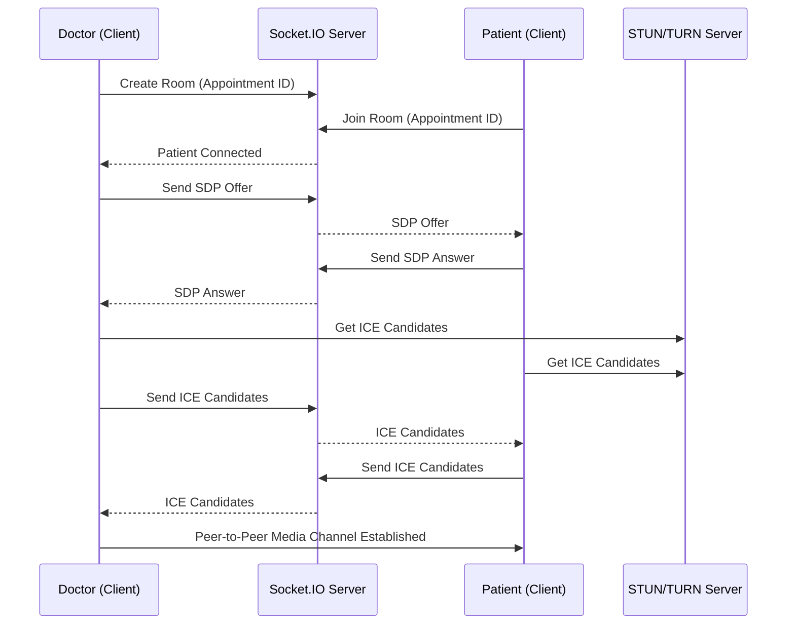

# APML Connect Pro - System Architecture

APML Connect Pro is a production-ready, multi-tenant SaaS healthcare ecosystem designed to scale to multi-hospital organizations, serving patients, doctors, nurses, receptionists, pharmacists, lab technicians, and administrators.

---

## 1. High-Level Architecture Diagram

This microservices-inspired monorepo structure connects modern web layers with containerized backend servers and caching mechanisms.

```mermaid
graph TD
    subgraph Client Layer (Next.js 15)
        P[Patient Web/Mobile App]
        D[Doctor Dashboard]
        R[Staff & Admin Dashboards]
    end

    subgraph Gateway & Load Balancer
        NG[Nginx Load Balancer]
    end

    subgraph Application Tier
        API[Express.js Node Backend Server]
        WSS[Socket.IO Signaling & Realtime Server]
    end

    subgraph Service Integrations
        AI[OpenAI API - Medical Assistant/Summarizer]
        SMS[Twilio / SMS Gateway]
        Pay[Stripe & Razorpay Payment Gateways]
        S3[AWS S3 - Medical Document Storage]
    end

    subgraph Persistence Layer
        DB[(PostgreSQL Primary DB)]
        Cache[(Redis Cache & Pub/Sub)]
    end

    %% Connections
    P -->|HTTPS/WSS| NG
    D -->|HTTPS/WSS| NG
    R -->|HTTPS/WSS| NG
    
    NG -->|HTTP| API
    NG -->|WS| WSS
    
    API -->|Prisma ORM| DB
    API -->|Cache Session/Rate Limit| Cache
    WSS -->|Rooms & Signalling State| Cache
    
    API --> AI
    API --> SMS
    API --> Pay
    API --> S3
```

---

## 2. Multi-Hospital & Multi-Tenancy Strategy

To achieve high scalability with low infrastructure overhead, APML Connect Pro adopts a **Logical Separation (Shared Database, Shared Schema)** tenancy model:
1. **Tenant Identification:** Each tenant (e.g., hospital group, clinic network) is assigned a unique `tenantId` (UUID).
2. **Subdomain Routing:** The application uses wildcard subdomains (e.g., `apollo.apml-connect.pro` or `max.apml-connect.pro`). Next.js middleware extracts the tenant sub-domain and sends it as a custom header (`X-Tenant-ID`) to the Express backend.
3. **Database Isolation:** All queries executed via the Prisma ORM automatically filter on the target `tenantId`.
4. **Data Encryption:** High-security fields (e.g., patient identity data) are encrypted at the application layer using tenant-specific cryptographic keys stored in AWS KMS.

---

## 3. Real-Time Telemedicine & WebRTC

APML Connect Pro uses peer-to-peer **WebRTC** for video/voice consultations, with **Socket.IO** acting as the signaling plane:
- **Signaling:** When a doctor starts a video consultation, they emit a `join-room` socket event. The server registers the room and holds the metadata.
- **Connection Handshake:** When the patient joins, the signaling server facilitates the exchange of SDP (Session Description Protocol) offers, answers, and ICE candidates between the client browsers.
- **STUN/TURN Servers:** For peers behind corporate firewalls or strict NATs (typical in hospital networks), a TURN server (e.g., coturn) relays media.
- **WebRTC Flow:**



---

## 4. AI Copilot Integration Architecture

The backend implements an asynchronous AI services engine powered by the **OpenAI API**:
- **Symptom Checker & Smart Prioritization:** Evaluates symptoms submitted by the patient and calculates an urgency score (Normal, Urgent, Emergency), suggesting appropriate slot timing.
- **Visit Summary Engine:** Upon appointment completion, the doctor's audio or text consultation notes are parsed and sent to OpenAI (`gpt-4o`) to generate structured EMR summaries containing chief complaints, history, and automated ICD-10 medical code recommendations.
- **Data De-identification:** Before sending EMR data to OpenAI, the application removes identifying patient data (name, phone, Aadhaar) to maintain HIPAA compliance.
